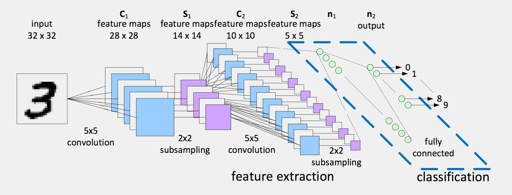
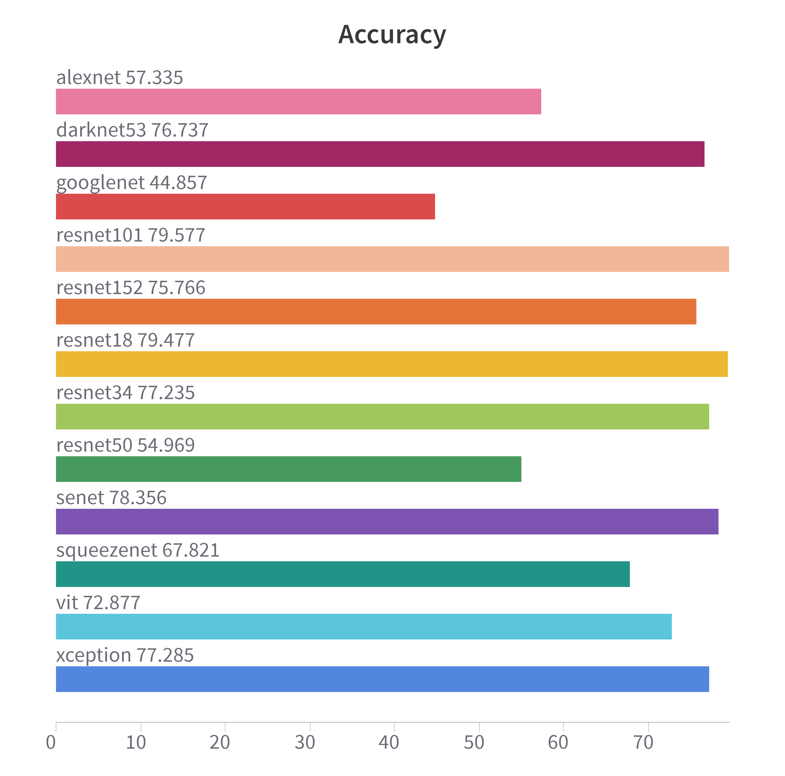

# Deep Learning Systems for Solar Panel Cells Defect 


<!--  -->

SOlar panel cells defect Classification uses computer vision models to classify defects in dataset that has already gone through imaging techniques like electroluminiscence or thermal imaging. Each models are applied on the benchmark dataset like elpv-4 with four classes, elpv-2 (Coined from elpv-4 but having 2 classes of functional and defective) and elpv-12 with 12 classes.

### 🗒 Datasets
You can find the Electroluminiscence PV (ELPV) dataset below:

[ELPV-4](https://drive.google.com/drive/folders/1sV79hmUzhJmufm1-69l9nbFt3mmvs9S-?usp=share_link)
[ELPV-2](https://drive.google.com/drive/folders/1tMi2dGcwTu_paL07YqQMkv4c8hvVWcyT?usp=share_link)
[ELPV-12](https://drive.google.com/drive/folders/150Pxn6sGFSCreA3VE4i0LlezDoUmccYH?usp=share_link)

<details>
  <summary>Sample Dataset </summary>
<p>
  
    The Elpv-12 dataset classifications with 11 defect classes including non defect class.
</p>
 
</details>

### 🗒 Models Implementation with accuracy results

Base Config: **{ epochs: 50, lr: 0.001, batch_size: 128, img_resolution: 224, optim: adam }**. 

Models architecture used are AlexNet, SENet, ResNet18, ResNet34, ResNet50,
ResNet101, ResNet152, GoogleNet (Inception V1), Xception, Vision
Transformer (Vit), YOLOv3 (DarkNet53), and SqueezeNet. 

Google Colab Premium of 14GB GPU was used for the training.

|Computer Vision Based Models   | ELPV-4 Accuracy | ELPV-2 Accuracy | ELPV-12 Accuracy |
| :---        | :----:       | :----:       | :----:       | :----:       | :---:       |
| [AlexNet](https://papers.nips.cc/paper/2012/hash/c399862d3b9d6b76c8436e924a68c45b-Abstract.html")| 67.62 | 62.12 | 83.85 |
| [SENet](https://arxiv.org/abs/1709.01507)   | 54.60 | 71.16 | 82.78 | 
| [ResNet18](https://arxiv.org/abs/1512.03385)  | 54.18 | 73.02 | 85.72 |
| [ResNet34](https://arxiv.org/abs/1512.03385)  | 56.98 | 68.84 | 88.44 |
| [ResNet50](https://arxiv.org/abs/1512.03385)  | 53.07 | 72.80 | 88.54 |
| [ResNet101](https://arxiv.org/abs/1512.03385)  | 54.60 | 65.82 | 86.45 |
| [ResNet152](https://arxiv.org/abs/1512.03385)  | 44.82 | 73.07 | 86.24 |
| [GoogLeNet](https://arxiv.org/abs/1409.4842)   | 65.77 | 62.12 | 82.55 | 
| [Xception](https://arxiv.org/abs/1610.02357)   | 56.30 | 64.87 | 91.40 | 
| [ViT](https://arxiv.org/abs/2010.11929)   | 57.67 | 39.68 | 84.95 |
| [Darknet-53](https://arxiv.org/pdf/1804.02767.pdf)   | 51.27 | 63.92 | 85.10 |
| [SqueezeNet](https://arxiv.org/abs/1602.07360v4)   | 60.16 | 62.75 | 87.37 | 


### 🗒 Running the code on Google Colab

<!--##########################################################################################-->

### Create Environment
```python
git clone https://github.com/tella26/Panel-Defects- 
```
```python
cd Panel-Defects-
```
### Installation
```python
!pip install -r requirements.txt
!pip install torchmetrics
!pip install torchensemble
```

### Login to Weights and Bias and create accounts to export your metrics. You can skip this if you dont want to log to W&B.
```python
!pip install wandb
!wandb login
```
### To mount Google drive for dataset import
```python
from google.colab import drive
drive.mount('/content/drive')
```

### Run
```python
!python main.py --model=resnet18 --train_path="/content/drive/MyDrive/dataset/train_data" --test_path="/content/drive/MyDrive/dataset/test_data" 
```
### To Save Model
```python
python main.py --model=resnet --model_save=True
```
### To Create Checkpoint
```python
python main.py --model=resnet --checkpoint=True
```

<!--##########################################################################################-->

### Paper Results
The plots for test accuracy and  test loss 

<details>
  <summary>🔥 Accuracy </summary>
<p>
  
    Accuracy results on the elpv-2 dataset

</p>
 
</details>

<details>
  <summary>🔥 Accuracy </summary>
<p>
  
    Loss plot results on the elpv-2 dataset

</p>
 
</details>

<!--##########################################################################################-->


### Acknowledgement
[Mayurji](https://github.com/Mayurji/Image-Classification-PyTorch.git)

### Citation
[H. Tella, M. Mohandes, B. Liu, S. Rehman and A. Al-Shaikhi, "Deep Learning System for Defect Classification of Solar Panel Cells," 2022 14th International Conference on Computational Intelligence and Communication Networks (CICN),
Al-Khobar, Saudi Arabia, 2022, pp. 448-453, doi: 10.1109/CICN56167.2022.10008277.](https://ieeexplore.ieee.org/document/10008277/metrics#metrics)

